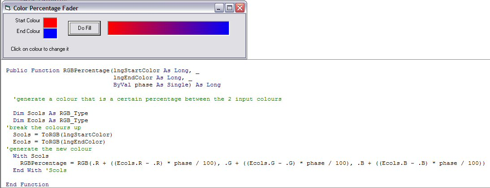



## Colour Percentage Fader

### Description

Colour Percentage Fader

Inspired by 'ColorFade' upload. Code lets you choose the start and end colours for a simple colour percentage bar. Screenshot added as requested
 
### More Info
 

             |
---                |---
**Submitted On**   |2003-11-22 13:13:40
**By**             |[Roger Gilchrist](https://github.com/Planet-Source-Code/PSCIndex/blob/master/ByAuthor/roger-gilchrist.md)
**Level**          |Beginner
**User Rating**    |5.0 (35 globes from 7 users)
**Compatibility**  |VB 4\.0 \(32\-bit\), VB 5\.0, VB 6\.0
**Category**       |[Graphics](https://github.com/Planet-Source-Code/PSCIndex/blob/master/ByCategory/graphics__1-46.md)
**World**          |[Visual Basic](https://github.com/Planet-Source-Code/PSCIndex/blob/master/ByWorld/visual-basic.md)
**Archive File**   |[Colour\_Per16746611212003\.zip](https://github.com/Planet-Source-Code/roger-gilchrist-colour-percentage-fader__1-50040/archive/master.zip)

